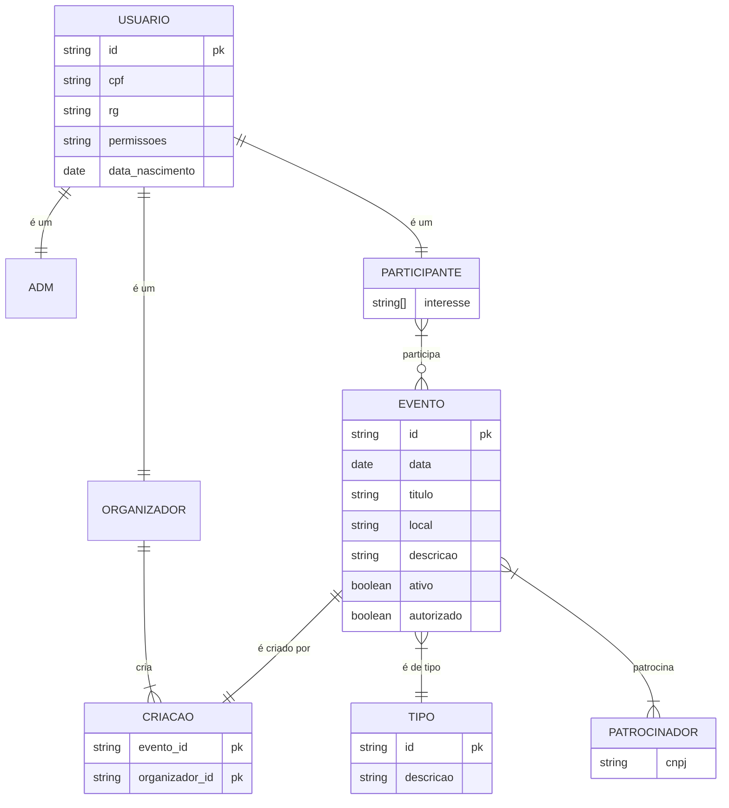

# Documento de Visão

Documento construído a partido do **Modelo_BSI_-_Doc_001_-_Documento_de_Visao_SigEvento** que pode ser encontrado no
link: <https://docs.google.com/document/d/1EZMq4H7l9eXpIhbgYRLK2Zbm6W0_0091QUN5shtL84U/edit>

## Equipe e Definição de Papéis

Membro              |     Papel     |   E-mail                         |
------------------  | ------------- | ----------                       |
Tallys Aureliano    | Analista, Gerente | <tallys.santos.017@ufrn.edu.br>
Italo Maurício      | Analista      | <italo.santos.059@ufrn.edu.br>
Lucas Mateus        | Analista      | <lucas.mateus.130@ufrn.edu.br>
Vinicius Maia       | Analista      | <vinicius.maia.706@ufrn.edu.br>
Dayanne Xavier      | Analista      | <dayanne.xavier.119@ufrn.edu.br>
Taciano Silva       | Cliente       | <taciano@bsi.ufrn.br>

### Matriz de Competências

Membro     |     Competências   |
---------  | ----------- |
Italo Maurício      | Java, git, postgresql, comunicação, resolução de problemas.
Dayanne Xavier      | Javascript, C, python, flutter, canva.
Lucas Mateus        | Git, python, django, django rest framework, flutter, postgresql, mediação de conflitos, gerencia de pessoas.
Tallys Aureliano    | Git, javascript, typescript, node, flutter, vue, canva, elaboração de requisitos, gerencia de atividades, mediação de conflitos.
Vinicius Maia       | Git, typescript, node, python, flutter, postgresql, mediação de conflitos, boa comunicação.

## Perfis dos Usuários

O sistema poderá ser utilizado por diversos usuários. Temos os seguintes perfis/atores:

Número | Perfil                        | Descrição   |
------ |------------------------------ | ----------- |
1 |Gerente da plataforma                  | Responsável pelo gerenciamento geral da plataforma. Possui acesso completo a todas as funcionalidades, principal função é validar e autorizar, organizações, eventos e patrocinadores.
2 | Organizador de Eventos                 | Usuário responsável pela criação e organização de eventos na plataforma. Pode cadastrar novos eventos, gerenciar participantes, definir agendas e enviar comunicações aos usuários envolvidos no evento.
3 | Participante                           | Usuário comum, pode visualizar eventos disponíveis, realizar inscrições, comentar no fórum dos eventos, feed da plataforma e interagir com os organizadores. Principal papel é se inscrever em eventos na plataforma.

## Lista de Requisitos Funcionais

Requisito                                 | Descrição   | Ator |
---------                                 | ----------- | ---------- |
RF001 - Inserir Usuário | O usuário deverá ser capaz de adicionar informações cadastrais para a inserção no sistema. | Todos os Usuários.
RF002 - Buscar Usuário | O usuário poderá selecionar um usuário por meio de busca por pesquisa: nome, idade, gênero, cpf, rg. | Gerente e Organizador.
RF003 - Visualizar Usuário | O usuário deverá ser capaz de ver suas informações na plataforma. | Todos os Usuários.
RF003.1 - Visualizar Usuário específico | O usuário deverá ser capaz de visualizar um usuário específico por busca. | Gerente da plataforma.
RF003.2 - Visualizar Usuário(s) específico do evento | O usuário deverá ser capaz de visualizar um usuário específico por busca, em que ele esteja cadastrado como participante no evento(s) em que o usuário buscador esteja como organizador. | Gerente da plataforma e Organizador.
RF004 - Alterar Usuário | O usuário poderá alterar suas informações pessoais. | Todos os Usuários. |
RF004.1 - Alterar qualquer usuário | O usuário poderá alterar qualquer usuário. | Gerente da Plataforma. |
RF005 - Excluir conta | O usuário poderá excluir sua conta na plataforma. | Todos os Usuários. |
RF005.1 - Excluir conta de usuário | O usuário poderá excluir a conta de outro usuário que ele busca. | Gerente.
RF006 - Inserir perguntas no formulário | O usuário poderá criar perguntas para o formulário de avaliação do evento| Organizador e Gerente.
RF007 - Alterar perguntas no formulário | O usuário poderá alterar as perguntas já criadas no formulário de inscrição | Organizador e Gerente.
RF008 - Excluir perguntas no formulário | O usuário poderá excluir as perguntas já criadas no formulário de inscrição | Organizador e Gerente.
RF009 - Alterar formulário | O usuário poderá alterar segmentos do formulário como nome, questões, e banners já criadas no formulário de inscrição | Organizador e Gerente.
RF010 - Visualizar formulários | O usuário poderá visualizar o formulário no evento para preenchimento. | Todos os usuários.
RF011 - Inserir evento | O usuário poderá inserir dados para realização de um evento com: nome, data de início e fim, quantidade máxima de inscrições e quantidade mínima, local, endereços eletrônicos, imagens do evento, logo e tipo(privado  ou público). | Organizador e Gerente.
RF012 - Alterar Evento | O usuário poderá alterar qualquer dado do evento. | Organizador e Gerente.
RF013 - Excluir eventos | O usuário poderá excluir evento, enviando uma mensagem para o gerente da plataforma aprovar e compartilhar a mensagem de exclusão do evento na plataforma para os inscritos no mesmo | Organizador e Gerente.
RF015 - Convidar participante | O usuário poderá convidar participantes por meio de email para eventos privados | Organizador e Gerente.
RF016 - Visualizar Evento | Os eventos e suas salas temáticas poderão ser visualizados por todos os usuários, exceto os privados que podem ser vistos apenas para convidados | Organizador e Gerente.
RF017 - Inserir sala temática no evento | O usuário poderá criar uma sala temática no evento com: nome, data de início e fim, quantidade máxima de inscrições e quantidade mínima, local, endereços eletrônicos, imagens do evento, logo, palestrante e artigos da sala.| Organizador e Gerente.
RF018 - Alterar Sala temática | O usuário poderá alterar qualquer dado da sala. | Organizador e Gerente.
RF019 - Excluir eventos | O usuário poderá excluir uma sala, enviando uma mensagem para o gerente da plataforma para aprovação e compartilhar a mensagem de exclusão da sala na plataforma para os inscritos. | Organizador e gerente.
RF020 - Realizar Inscrição | O usuário poderá realizar inscrição em algum evento. | Todos os usuários.
RF020.1 - Inscrição Adicionada | O usuário poderá ser adicionado a um evento. | Gerente.
RF021 - Cancelar Inscrição | O usuário poderá cancelar sua inscrição em qualquer eventos | Todos os Usuários.   
RF022 - Marcar presença | O usuário pode marcar presença de uma participante em um determinado eventos ou sala | Organizador e Gerente.
RF023 - Marcar presença automática | O usuário pode escolher quantas presenças em salas temáticas podem garantir a presença no evento principal. | Organizador e Gerente.
RF024 - Contestar presença. | O usuário pode contestar sua presença não marcada no evento/sala, deve ser enviada uma mensagem para o Organizador com um texto e uma imagem como prova da sua participação. | Participante.
RF025 - Inserir Patrocinador | O usuário poderá pedir para ser patrocinador do evento, cabendo ao organizador aprovar ou não. O gerente também poderá cadastrar um patrocinador. | Organizador e Gerente.
RF026 - Alterar Patrocinador | O usuário poderá alterar um patrocinador já existente. | Organizador e Gerente.
RF027 - Excluir patrocinador | O usuário poderá excluir um patrocinador, enviando uma mensagem para o gerente da plataforma para aprovação | Organizador e Gerente.
RF028 - Listar eventos por datas e locais | O usuário poderá ver seus eventos ou eventos da plataforma em formato de agenda/calendário. | Todos os Usuários.
RF029 - Listagem geral de participantes no evento | O usuário deve conseguir ver a lista completa de usuários que se inscreveram no evento, essa busca pode ter filtros de participantes. | Organizador e Gerente.
RF030 - Mensagem para participantes | O usuário poderá enviar mensagens de email para os participantes do evento. | Organizador e Gerente.
RF031 - Inserir comentário no forum da plataforma | O usuário poderá incluir seus comentários no fórum da plataforma.| Todos os Usuários.
RF032 - Alterar comentário | O usuário poderá apagar o comentário já feito | Todos os Usuários.
RF033 - Apagar comentario | O usuário poderá apagar comentários já feitos. | Todos os usuários.
RF033.1 - Apagar comentário de usuário | O usuário poderá apagar comentarios de outros usuarios | Gerente da Plataforma. |
RF034 - Denunciar comentário  | O usuário poderá denunciar o comentário feito por outro usuário e ele poderá ser apagado pelo Gerente da plataforma | Todos os Usuários.
RF034.1 - Confirmar denuncia | O usuário poderá confirmar a denúncia do comentário e ele automaticamente será apagado. | Gerente da plataforma.
RF035 - Inserir Local | O usuário poderá inserir dados de um local para seu evento com: nome e endereço. | Organizador e Gerente.
RF036 - Alterar Local | O usuário poderá alterar um local já existente. | Organizador e Gerente.
RF037 - Gerar certificado | O usuário deve conseguir ver seu certificado quando obtiver presença no evento principal com suas horas. O certificado terá: nome do participante, CPF, horas dadas pelo evento e verificação do certificado. | Todos os Usuários.
RF038 - Gerar crachá | O usuário poderá visualizar seu crachá com suas informações pessoais e/ou ações que ele vai realizar no evento. | Todos os usuários.
RF038.1 - Alterar crachá | O usuário poderá alterar/adicionar informaçẽos para o seu crachá.

## Lista de Requisitos Não-Funcionais

Requisito                                 | Descrição   |
---------                                 | ----------- |
RNF01 - Segurança e Autenticação | Implementar mecanismos robustos de segurança e autenticação para proteger os dados dos usuários e informações sensíveis dos eventos.
RNF02 - Escalabilidade | Garantir que a plataforma seja escalável, capaz de lidar com um grande número de eventos e usuários simultaneamente.
RNF03 - Usabilidade | Desenvolver uma interface intuitiva e de fácil uso, proporcionando uma experiência agradável aos usuários.
RNF04 - Conformidade Legal | Assegurar que a plataforma esteja em conformidade com todas as leis e regulamentos aplicáveis, especialmente no que diz respeito à proteção de dados e direitos do consumidor.

## Riscos

Tabela com o mapeamento dos riscos do projeto, as possíveis soluções e os responsáveis.

Data | Risco | Prioridade | Responsável | Status | Providência/Solução |
------ | ------ | ------ | ------ | ------ | ------ |
07/03/2024 | Possibilidade de não compreensão total das funcionalidades da plataforma | Alta | Gerente | Vigente | Realizar treinamentos e oferecer suporte contínuo aos usuários.
07/03/2024 | Risco de Sobrecarga do Servidor |Alta | Gerente | Vigente | Monitoramento constante da carga do servidor, implementação de escalabilidade e redundância.
08/04/2024 | Falta de pessoal ativo na gerencia da plataforma, em virtude de processos que necessitam da sua avaliação | Média | Gerente | Futura | Comprometimento de pessoas responsáveis e fixas na gerencia da plataforma.  

## Modelos

### Modelo de entidade relacionamento

Para criar modelos ER é possível usar o BrModelo e gerar uma imagem. Contudo, atualmente é possível criar modelos ER usando a ferramenta **Mermaid**, escrevendo o modelo diretamente em markdown. Acesse a documentação para escrever modelos [ER Diagram Mermaid](https://mermaid-js.github.io/mermaid/#/entityRelationshipDiagram).

