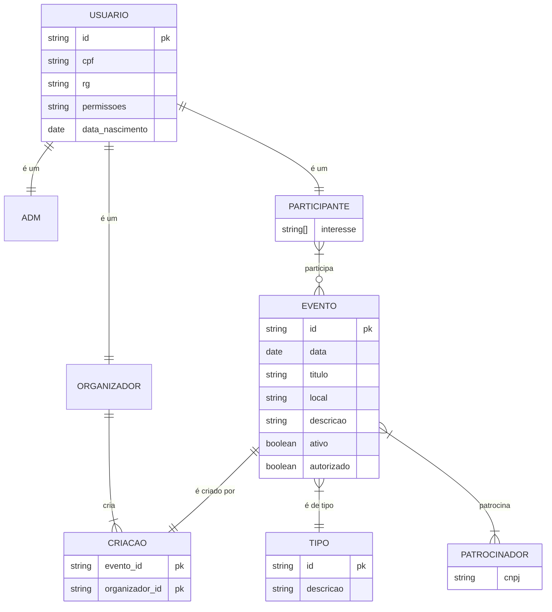

# Documento de Visão

Documento construído a partido do **Modelo_BSI_-_Doc_001_-_Documento_de_Visao_SigEvento** que pode ser encontrado no
link: <https://docs.google.com/document/d/1EZMq4H7l9eXpIhbgYRLK2Zbm6W0_0091QUN5shtL84U/edit>

## Equipe e Definição de Papéis

Membro              |     Papel     |   E-mail                         |
------------------  | ------------- | ----------                       |
Tallys Aureliano    | Analista, Gerente | <tallys.santos.017@ufrn.edu.br>
Italo Maurício      | Analista      | <italo.santos.059@ufrn.edu.br>
Lucas Mateus        | Analista      | <lucas.mateus.130@ufrn.edu.br>
Vinicius Maia       | Analista      | <vinicius.maia.706@ufrn.edu.br>
Dayanne Xavier      | Analista      | <dayanne.xavier.119@ufrn.edu.br>
Taciano Silva       | Cliente       | <taciano@bsi.ufrn.br>

### Matriz de Competências

Membro     |     Competências   |
---------  | ----------- |
Italo Maurício      | Java, git, postgresql, comunicação, resolução de problemas.
Dayanne Xavier      | Javascript, C, python, flutter, canva.
Lucas Mateus        | Git, python, django, django rest framework, flutter, postgresql, mediação de conflitos, gerencia de pessoas.
Tallys Aureliano    | Git, javascript, typescript, node, flutter, vue, canva, elaboração de requisitos, gerencia de atividades, mediação de conflitos.
Vinicius Maia       | Git, typescript, node, python, flutter, postgresql, mediação de conflitos, boa comunicação.

## Perfis dos Usuários

O sistema poderá ser utilizado por diversos usuários. Temos os seguintes perfis/atores:

Número | Perfil                        | Descrição   |
------ |------------------------------ | ----------- |
1 |Gerente da plataforma                  | Responsável pelo gerenciamento geral da plataforma. Possui acesso completo a todas as funcionalidades, principal função é validar e autorizar, organizações, eventos e patrocinadores.
2 | Organizador de Eventos                 | Usuário responsável pela criação e organização de eventos na plataforma. Pode cadastrar novos eventos, gerenciar participantes, definir agendas e enviar comunicações aos usuários envolvidos no evento.
3 | Participante                           | Usuário comum, pode visualizar eventos disponíveis, realizar inscrições, comentar no fórum dos eventos, feed da plataforma e interagir com os organizadores. Principal papel é se inscrever em eventos na plataforma.

## Lista de Requisitos Funcionais

Requisito                                 | Descrição   | Ator |
---------                                 | ----------- | ---------- |
RF001 - Inserir Usuário | O usuario deverá ser capaz de adicionar informações cadastrais para a inserção no sistema. | Todos os Usuarios.
RF002 Buscar Usuario | O usuario poderar um usuario por meio de busca por pesquisa: nome, idade, genero, cpf, rg. | Gerente e Organizador.
RF003 - Visualizar Usuario | O usuario deverá ser capaz de ver suas informações na plataforma. | Todos os Usuarios.
RF003.1 - Visualizar Usuario especifico | O usuario deverá ser capaz de visualizar um usuario espeficio por busca. | Gerente da plataforma.
RF003.2 - Visualizar Usuario(s) especifico do evento | O usuario deverá ser capaz de visualizar um usuario espeficio por busca, em que ele esteja cadastrado como participante no evento(s) em que o usuario buscador esteja como organizador. | Gerente da plataforma e Organizador.
RF004 - Alterar Usuario | O usuario poderá alterar suas informações pessoais. | Todos os Usuarios. |
RF004.1 - Alterar qualquer usuario | O usuario poderá alterar qualquer usuario. | Gerente da Plataforma. |
RF005 - Excluir conta | O usuario poderá excluir sua conta na plataforma. | Todos os Usuarios. |
RF005.1 - Excluir conta de usuario | O usuario poderá exluir conta de outro usuario que ele buscar. | Gerente.
RF006 - Inserir perguntas no formulario | O usuario poderar criar perguntas para o formulario de avaliação do evento| Orgnizador e Gerente.
RF007 - Alterar perguntas no formulario | O usuario poderar alterar as perguntas já criadas no formulario de inscrição | Organizador e Gerente.
RF008 - Excluir perguntas no formulario | O usuario poderar excluir as perguntas já criadas no formulario de inscrição | Organizador e Gerente.
RF009 - Alterar formulario | O usuario poderar alterar segmentos do formulario como nome, questões, e banners já criadas no formulario de inscrição | Organizador e Gerente.
Antigo | Antigo | Antigo.
RF001 - Manter Usuários | Permitir o cadastro e manutenção de usuários na plataforma, incluindo a possibilidade de alterar dados do usuário, excluir dados do usuário, cadastrar novos usuários e visualizar usuários. | Organizador de Eventos e Gerente da Plataforma.
RF003 - Alterar Usuario | O usuario deverá ser capaz de alterar suas informações pessoais na plataforma
RF002 - Manter Eventos | Permitir o cadastro e manutenção de eventos na plataforma, incluindo informações como nome, data, local, descrição e tipo de evento | Organizador de Eventos.
RF003 - Gerenciar Participantes | Possibilitar o controle de participantes inscritos em cada evento, incluindo informações como nome, contato e status de pagamento | Organizador de Eventos
RF004 - Controlar Agenda | Permitir o gerenciamento de agenda, com visualização de datas disponíveis e agendadas para eventos | Organizador de Eventos
RF005 - Geração de Relatórios | Gerar relatórios informativos sobre eventos realizados, participantes, receitas e despesas | Administrador
RF006 - Comunicação com Clientes | Possibilitar o envio de mensagens e notificações aos clientes sobre novos eventos, atualizações e informações relevantes | Organizador de Eventos
RF007 - Controle Financeiro | Permitir o registro e controle de pagamentos, incluindo faturamento, recibos, e status de pagamento dos participantes |Administrador
RF008 - Avaliação dos eventos | Permitir que os participantes avaliem e forneçam feedbacks sobre os eventos após a conclusão do mesmo | Cliente
RF009 - Sistema de reservas | Permitir que o cliente reserve e confirme sua participação no evento | Cliente  
RF0010 - Gerenciamento de patrocinadores | Possibilitar o cadastro e gerenciamento de patrocinadores para eventos, incluindo informações sobre eles | Organizador de eventos  
RF011 - Calendário de eventos | Disponibilizar um calendário público de eventos, permitindo que os participantes visualizem e acompanhem os eventos futuros, e os participantes convidados podem visualizar no calendário os eventos privados | Cliente
RF012 - Recomendações personalizadas | Uma vez cadastrado na plataforma, os usuários podem marcar quais tipos de eventos eles tem interesse, com base nisso e no histórico de eventos já participados, o sistema pode sugerir eventos para ele participar | Cliente

## Lista de Requisitos Não-Funcionais

Requisito                                 | Descrição   |
---------                                 | ----------- |
RNF01 - Segurança e Autenticação | Implementar mecanismos robustos de segurança e autenticação para proteger os dados dos usuários e informações sensíveis dos eventos.
RNF02 - Escalabilidade | Garantir que a plataforma seja escalável, capaz de lidar com um grande número de eventos e usuários simultaneamente.
RNF03 - Usabilidade | Desenvolver uma interface intuitiva e de fácil uso, proporcionando uma experiência agradável aos usuários.
RNF04 - Conformidade Legal | Assegurar que a plataforma esteja em conformidade com todas as leis e regulamentos aplicáveis, especialmente no que diz respeito à proteção de dados e direitos do consumidor.

## Riscos

Tabela com o mapeamento dos riscos do projeto, as possíveis soluções e os responsáveis.

Data | Risco | Prioridade | Responsável | Status | Providência/Solução |
------ | ------ | ------ | ------ | ------ | ------ |
07/03/2024 | Possibilidade de não compreensão total das funcionalidades da plataforma | Alta | Gerente | Vigente | Realizar treinamentos e oferecer suporte contínuo aos usuários.
07/03/2024 | Risco de Sobrecarga do Servidor |Alta | Gerente | Vigente | Monitoramento constante da carga do servidor, implementação de escalabilidade e redundância.
08/04/2024 | Falta de pessoal ativo na gerencia da plataforma, em virtude de processos que necessitam da sua avaliação | Média | Gerente | Futura | Comprometimento de pessoas responsáveis e fixas na gerencia da plataforma.  

## Modelos

### Modelo de entidade relacionamento

Para criar modelos ER é possível usar o BrModelo e gerar uma imagem. Contudo, atualmente é possível criar modelos ER usando a ferramenta **Mermaid**, escrevendo o modelo diretamente em markdown. Acesse a documentação para escrever modelos [ER Diagram Mermaid](https://mermaid-js.github.io/mermaid/#/entityRelationshipDiagram).

