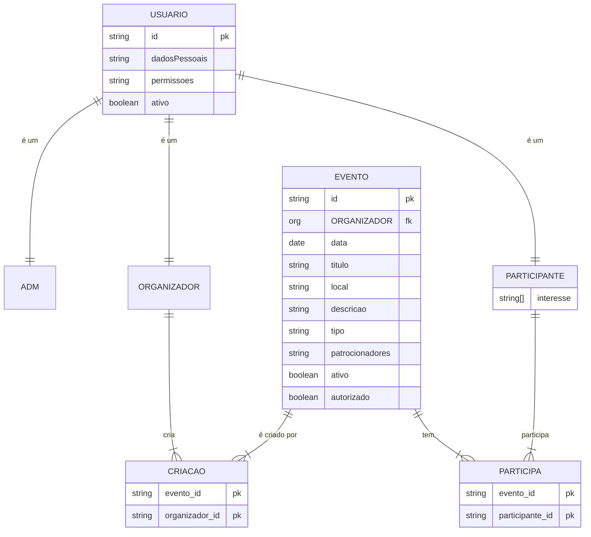

# Modelo Conceitual

```mermaid
erDiagram
    USUARIO {
        string id pk
        string dadosPessoais
        string permissoes
        boolean ativo
    }
    
    ADM
    
    ORGANIZADOR
    
    PARTICIPANTE {
        string[] interesse
    }

    USUARIO ||--|| ADM : "é um"
    USUARIO ||--|| ORGANIZADOR : "é um"
    USUARIO ||--|| PARTICIPANTE : "é um"
    
    EVENTO {
        string id pk
        org ORGANIZADOR fk
        date data
        string titulo
        string local
        string descricao
        string tipo
        string patrocionadores
        boolean ativo
        boolean autorizado
    }

    CRIACAO {
        string evento_id pk
        string organizador_id pk
    }

    EVENTO ||--|{ CRIACAO : "é criado por"
    ORGANIZADOR ||--|{ CRIACAO : cria
    
    PARTICIPA {
        string evento_id pk
        string participante_id pk
    }

    PARTICIPANTE ||--|{ PARTICIPA : participa
    EVENTO ||--|{ PARTICIPA : tem
```