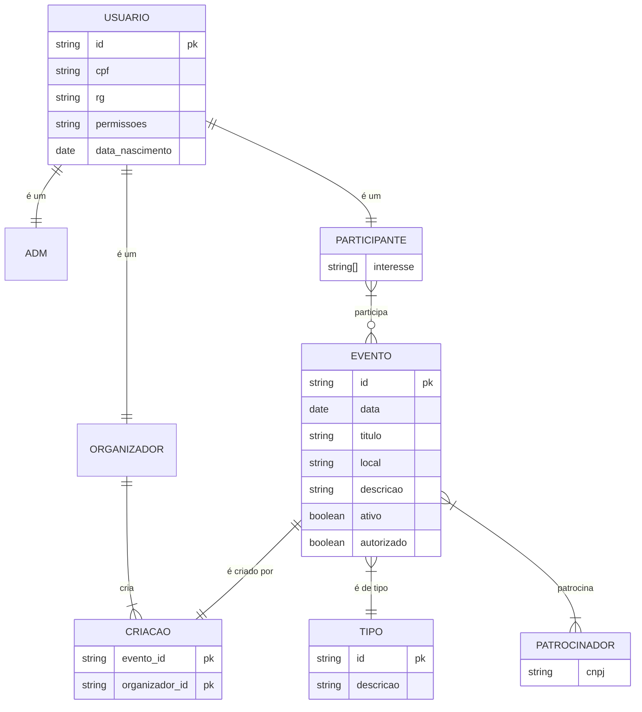

# Modelo Conceitual

```mermaid
erDiagram
    USUARIO {
        string id pk
        string cpf
        string rg
        string permissoes
        date data_nascimento
    }
    
    ADM

    ORGANIZADOR 
    
    PARTICIPANTE {
        string[] interesse
    }
    
    TIPO {
        string id pk
        string descricao
    }

    EVENTO {
        string id pk
        date data
        string titulo
        string local
        string descricao
        boolean ativo
        boolean autorizado
    }

    PATROCINADOR{
        string cnpj
    }
    
    CRIACAO {
        string evento_id pk
        string organizador_id pk
    }
    
    %% PARTICIPA {
    %%     string evento_id pk
    %%     string participante_id pk
    %% }

    USUARIO ||--|| ORGANIZADOR : "é um"
    USUARIO ||--|| PARTICIPANTE : "é um"
    USUARIO ||--|| ADM : "é um"
    %% Na duvida se isso se mantém PARTICIPANTE ||--|{ PARTICIPA : participa
    PARTICIPANTE }|--o{ EVENTO : "participa"
    ORGANIZADOR ||--|{ CRIACAO : cria
    EVENTO ||--|| CRIACAO : "é criado por"
    EVENTO }|--||TIPO : "é de tipo"
    EVENTO }|--|{ PATROCINADOR : "patrocina"
```